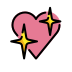

# Attribution

Homepage images originate from [OpenMoji](https://openmoji.org), licensed under
[CC BY-SA 4.0](https://creativecommons.org/licenses/by-sa/4.0/). The color of
the dancing man emoji was changed to align with the rest of the website.
